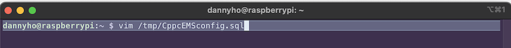

# Cppc Equipment Management System
#### The full equipment management system for clubs in school

###### This is the system originally created for 'Collecting Pals Photography Club', but it's also easy to change it to your own club, see below to know how to customize & deploy it on your own server.

---

## The composition of the project
This project in build for Raspberry Pi OS server, but it should fit most of the other OSs as it uses Docker to deploy services. The API is in the /api folder and APP in /app folder that you can just pull the project and customize them from there.  

## How to deploy the service
To let this application fully working, first you'll have to do the things below : 
##### 1. Clone the project
Just use the following command to download it at the place you want : 
`git clone https://github.com/Hmc-1209/Cppc-equipment-management-system.git`  

##### 2. Setup
- You can use the desired SQL database for storing datas. Mine is MariaDB as it's suitable for RasPi. If your using other databases, just make sure to adjust the setting in step 4.  
- Make Sure your server can use ssh connection.

##### 3. Create database structure
There's a file called create-database.sql in /db folder, it generates the database and setup default users for it. Before you use it, please creat a file called "CppcEMSconfig.sql" (Or change the name if you want) in the path /tmp on your server and enter the password you want for the database in it. You could use vim to edit it and just enter the password with the SQL format : 


Make sure to wrap the password with single quote! Then, use SOURCE command in sql client to let the database setup completely : 
`SOURCE /path/to/your/application_folder/db/create-database.sql`  


Remember to change the path to your application path.

##### 4. Create API connection configuration files
In /api folder, create a file called 'config.py', and enter the following lines (Change the capitalize words to your own data) :

```
ssh_username = 'YOUR_SSH_USERNAME'
ssh_password = 'YOUR_SSH_PASSWORD'
db_password = 'YOUR_DATABASE_PASSWORD'
```
Next, generate a secret key using the following command (`openssl rand -hex 64`) for encrpting your application's users info, and create another 'config.py' file in /api/Authentication and enter your desired secret key and algorithm in it. You can change the algorithm but HS256 is recommanded.

```
ACCESS_TOKEN_SECRET_KEY = 'YOUR_APPLICATION_SECRET_KEY'
ALGORITHM = 'HS256'
```

##### 5. Create admin user for the application
You will have to create a user manually using the following command to let you able to login in the application. First, run the create_password_hash.py for your admin password, enter plain text and it will give you hashed password :   
`python3 create_password_hash.py`
Then log into mysql again using the new created user 'CppcEMSAdmin' and use the following command to generate the user.
```
USE CppcEMS;
CREATE User(username, password) VALUES (CppcAdmin, YOUR_HASHED_PASSWORD);
```


##### 6. Get ready to start the application !
The final step is to start the application. There is a script called **`start.sh`** in the root directory. Run it and wait for docker to handle all the process for you. (If it is the first time you build this application, it will take some time for docker to process needed commands for each layers). After you see these output you should be good to go! Now, nevigate to port 9000 and the application should appeared there.
